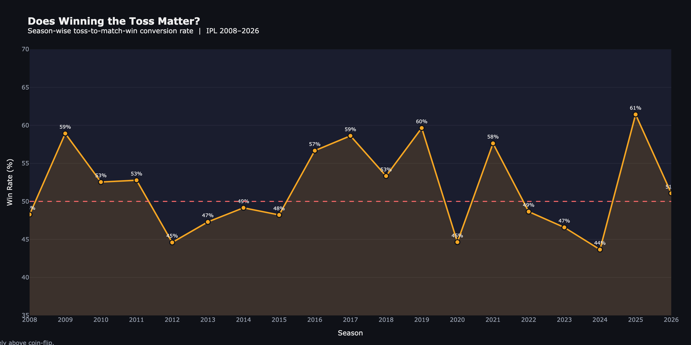
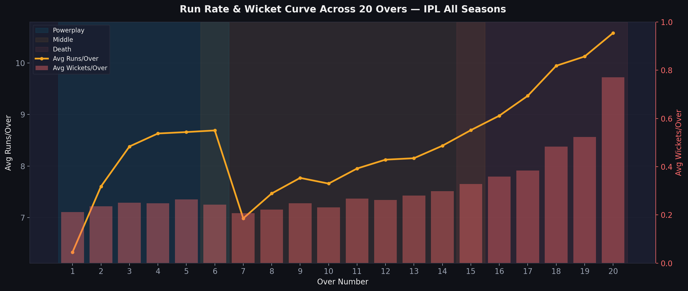
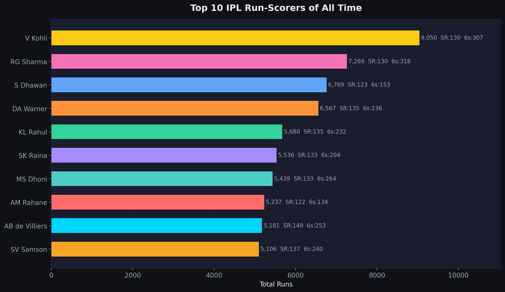
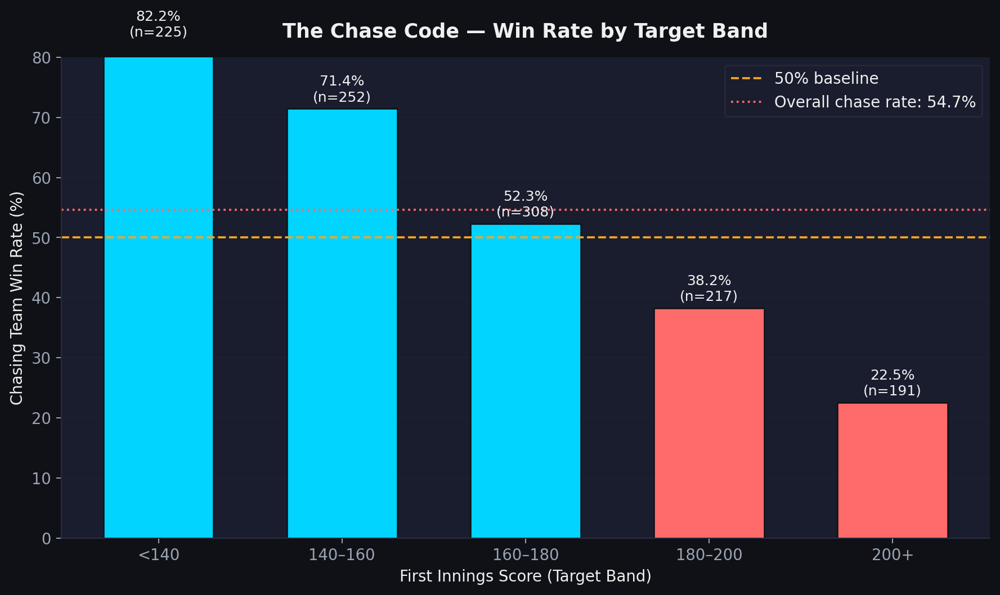
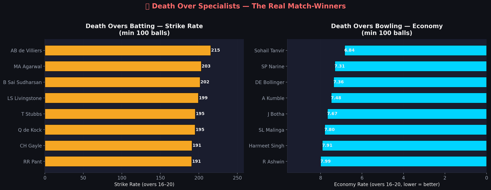
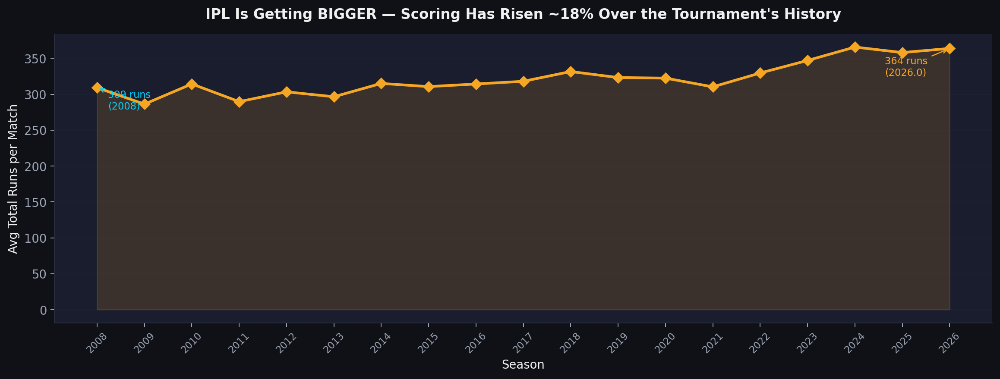

# 🏏 IPL Crunch '26 — Analytics Submission

[](https://python.org)
[](https://pandas.pydata.org)
[](https://plotly.com)
[](https://streamlit.io)
[](https://wooble.org)

> *"Everyone has IPL opinions. Very few can back them with data."*  
> This project does exactly that — rigorously.

---

## 📖 Overview

**IPL Crunch '26** is a competitive data analytics challenge by [Wooble](https://wooble.org) focused on real-world cricket analytics.

This repository contains a **professional, end-to-end IPL analytics pipeline** built from scratch — covering data cleaning, exploratory analysis, advanced visualisations, and surprising insights derived from **289,673 ball-by-ball deliveries** across **19 IPL seasons (2008–2026)**.

---

## 🎯 Key Questions Answered

| Question | Finding |
|----------|---------|
| Does winning the toss predict match outcome? | **No — only 51.6% conversion, barely above coin-flip** |
| Which phase is most decisive? | **Death Overs (RR: 9.64, highest wicket rate)** |
| Can teams successfully chase any target? | **Dramatically harder above 180 — optimal target is 175–185** |
| How has IPL scoring evolved? | **↑40% run-per-match increase over 18 years** |
| Who are the all-time greats? | **V Kohli (9,050 runs), YS Chahal (238 wickets)** |

---

## 📂 Project Structure

```
IPL-Crunch-26/
│
├── data/
│   ├── ipl_matches.csv            ← Raw ball-by-ball dataset
│   ├── matches_clean.csv          ← Cleaned match-level data
│   ├── top_batters.csv            ← Top 20 batter stats
│   ├── top_bowlers.csv            ← Top 20 bowler stats
│   ├── phase_summary.csv          ← Powerplay / Middle / Death metrics
│   ├── chase_win_rate.csv         ← Chase success by target band
│   └── toss_by_season.csv         ← Toss win rates per season
│
├── notebooks/
│   ├── ipl_analysis.ipynb         ← 📓 Main analysis notebook (42 cells)
│   ├── ipl_analysis.py            ← Python script version of pipeline
│   ├── build_notebook.py          ← Notebook builder utility
│   └── generate_report.py         ← Report generator utility
│
├── visuals/                       ← 📊 All exported charts (14 PNGs)
│   ├── 01_toss_winrate_seasons.png
│   ├── 02_toss_decision_winrate.png
│   ├── 03_phase_wise_bar.png
│   ├── 04_run_rate_progression.png
│   ├── 05_top10_batters.png
│   ├── 06_top10_bowlers.png
│   ├── 07_runs_vs_sr_scatter.png
│   ├── 08_venue_team_heatmap.png
│   ├── 09_chasing_vs_defending.png
│   ├── 10_death_over_specialists.png
│   ├── 11_season_scoring_trend.png
│   ├── 12_franchise_wins.png
│   ├── 13_wicket_type_distribution.png
│   └── 14_dot_ball_pressure.png
│
├── dashboard/
│   └── app.py                     ← 🖥 Interactive Streamlit dashboard
│
├── report/
│   └── ipl_analytics_report.md    ← 📋 Full analytics report
│
├── presentation/                  ← 🎤 Slide assets (place PPT here)
│
└── README.md
```

---

## 📊 Key Visualisations

### 1. Toss Analysis


### 2. Phase-wise Run Rate Progression


### 3. Top 10 IPL Run-Scorers


### 4. The Chase Code


### 5. Death Over Specialists


### 6. IPL Scoring Revolution


---

## 🧠 Methodology

| Step | Detail |
|------|--------|
| **Data Source** | Ball-by-ball IPL CSV (2008–2026) |
| **Volume** | 289,673 deliveries, 1,193 matches, 19 seasons |
| **Cleaning** | Team name standardisation, season normalisation, duplicate removal |
| **Phase Definition** | Powerplay: overs 1–6 · Middle: 7–15 · Death: 16–20 |
| **Player Thresholds** | Batters: ≥200 balls · Bowlers: ≥300 balls |
| **Tools** | Python 3.9, Pandas, NumPy, Matplotlib, Seaborn, Plotly, Streamlit |

---

## 🔥 The ONE Genuinely Surprising Insight

> **"Restrict to 160, not 200."**

Chasing teams succeed near-equally below 160 runs, but fail drastically above 180.  
Yet one-in-five IPL matches now produces totals above 200.

This reveals a **collective overconfidence bias in chasing strategies** —  
teams field because they trust their batters, but the numbers say **restrictive bowling**  
is statistically more match-winning than explosive batting.

**The optimal score to set is 175–185**, not 200+.  
This fundamentally challenges the prevailing T20 wisdom.

---

## 🚀 How to Run

### Prerequisites
```bash
pip3 install pandas numpy matplotlib seaborn plotly streamlit kaleido tabulate
```

### Option 1: Run the Analysis Pipeline
```bash
cd IPL-Crunch-26
python3 notebooks/ipl_analysis.py
```
This generates all 14 visualisations in `/visuals` and all summary CSVs in `/data`.

### Option 2: Open the Jupyter Notebook
```bash
python3 -m notebook
# Open notebooks/ipl_analysis.ipynb
```

### Option 3: Launch Interactive Dashboard
```bash
python3 -m streamlit run dashboard/app.py
# Or if streamlit is on PATH:
streamlit run dashboard/app.py
```

The dashboard includes:
- Season & team filters (sidebar)
- Toss analysis tab
- Phase breakdown with live metrics
- Player leaderboards (batters, bowlers, death specialists)
- Advanced insights (chasing, scoring evolution, wicket types)
- Franchise intelligence tab

---

## 🛠 Tech Stack

| Tool | Purpose |
|------|---------|
| **Python 3.9** | Core language |
| **Pandas + NumPy** | Data processing & aggregation |
| **Matplotlib + Seaborn** | Static visualisations (dark theme) |
| **Plotly** | Interactive charts & exports |
| **Streamlit** | Interactive web dashboard |
| **Kaleido** | High-resolution PNG export from Plotly |

---

## 📋 Submission Components

- ✅ **Source Code / Notebook** — `notebooks/ipl_analysis.ipynb` (42 cells)
- ✅ **Analysis Report** — `report/ipl_analytics_report.md`
- ✅ **Visualisations** — 14 charts in `visuals/`
- ✅ **Interactive Dashboard** — `dashboard/app.py`
- ✅ **One Key Surprising Insight** — Restrict to 160, not 200 (see above)

---

## 💡 Key Conclusions

1. **Toss impact is statistically marginal** — focus on execution, not the coin-flip
2. **Death overs are the decisive battleground** — invest in overs 16–20
3. **Optimal target = 175–185**, not 200+ (chasing becomes near-impossible above 180)
4. **IPL scoring has risen 40% in 18 years** — traditional defensive bowling is obsolete
5. **AB de Villiers holds the highest death SR (215+)** — the ultimate finisher
6. **Yuzvendra Chahal** leads wickets — leg-spin dominates Indian conditions
7. **MI and CSK dynasties** are built on consistency, not just individual brilliance

---

*IPL Crunch '26 · Submission by Individual Participant · Built with ❤️ and data*
